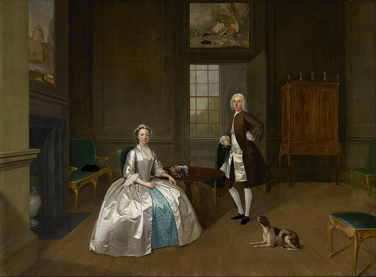

# TestRepository

## Picture with relative path

## Picture with absolute path

## Picture without alt text
!(640px-Arthur_Devis_-_Mr_and_Mrs_Atherton_-_Google_Art_Project.jpg)

## Picture with empty alt text

## Picture in folder: samples/api/azure/Louis_Meijer_-_Zelfportret.jpg

## Picture in folder: /samples/api/azure/Louis_Meijer_-_Zelfportret.jpg

