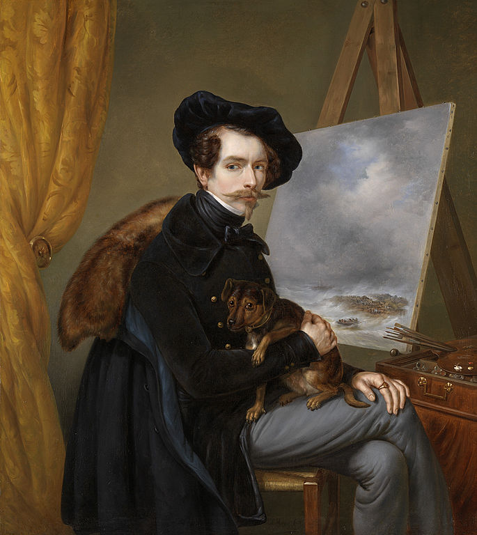

# README2

## api/azure/Louis_Meijer_-_Zelfportret.jpg

## /samples/api/azure/Louis_Meijer_-_Zelfportret.jpg

## samples/api/azure/Louis_Meijer_-_Zelfportret.jpg

## Giuseppe_Barberis_-_Carlo_Cornaglia_-_Giuseppe_Verdi's_Don_Carlo_at_La_Scala.jpg

## /640px-Arthur_Devis_-_Mr_and_Mrs_Atherton_-_Google_Art_Project.jpg

## /Folder/1200px-Great_Wave_off_Kanagawa2.jpg

## https://github.com/mpMelnikov/TestRepository/raw/master/samples/Giuseppe_Barberis_-_Carlo_Cornaglia_-_Giuseppe_Verdi's_Don_Carlo_at_La_Scala.jpg

